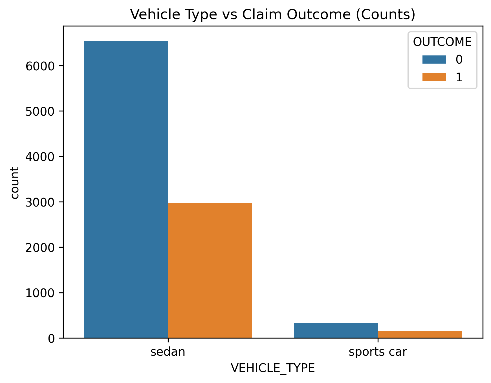

# 🚗 Car Insurance Claim Prediction

A complete Machine Learning project that predicts whether a customer will file a car insurance claim.

The project progresses through three stages:

1. Exploratory Data Analysis (EDA) & Random Forest Baseline
2. Feature Engineering & Feature Selection
3. Deep Learning with Hyperparameter Optimization (Keras Tuner)

## 📁 Project Structure

```
├── Car_Insurance_Claim_Prediction.ipynb
├── Car_Insurance_Claim.csv
├── README.md
├── Distribution of Claims.png
├── Claim Rate by Driving Experience.png
├── Average Credit Score by Claim Outcome.png
├── claim_rate_by_age.png
├── vehicle_type_vs_claim.png
├── correlation_heatmap.png
└── top10_features.png
```

## 📊 Dataset

- **Size:** 10,000 customers × 19 features
- **Target Variable:** `OUTCOME`
  - `1` = Customer filed a claim
  - `0` = No claim filed
- **Class Balance:** 68.67% no claim / 31.33% claim

### Feature Categories

| Type | Features |
|---|---|
| Numeric | CREDIT_SCORE, ANNUAL_MILEAGE, SPEEDING_VIOLATIONS, DUIS, PAST_ACCIDENTS |
| Binary | VEHICLE_OWNERSHIP, MARRIED, CHILDREN |
| Ordinal | AGE, DRIVING_EXPERIENCE, EDUCATION, INCOME |
| Nominal | GENDER, RACE, VEHICLE_YEAR, VEHICLE_TYPE, POSTAL_CODE |

The dataset is moderately imbalanced — 68.67% non-claimants vs 31.33% claimants. This motivated the use of stratified sampling and `class_weight='balanced'` during modeling.

## 📈 Exploratory Data Analysis (EDA)

### Distribution of Claims


**Insight:** The dataset is moderately imbalanced — 68.67% non-claimants vs 31.33% claimants. This motivated the use of stratified sampling and `class_weight='balanced'` during modeling.

### Vehicle Type vs Claim Outcome



### Claim Rate by Driving Experience


**Insight:** Drivers with 0–9 years of experience show a claim rate above 60%, dropping sharply as experience increases. Driving experience is one of the strongest predictors in the dataset.

### Claim Rate by Age


**Insight:** The 16–25 age group shows the highest claim count among claimants, consistent with inexperienced drivers taking more risks on the road.

### Average Credit Score by Claim Outcome


**Insight:** Customers who did not file a claim have noticeably higher average credit scores (~0.52) compared to those who did (~0.44), suggesting a link between financial responsibility and driving risk.

### Correlation Heatmap


**Insight:** CREDIT_SCORE (−0.33) and VEHICLE_OWNERSHIP (−0.38) show the strongest negative correlations with OUTCOME. SPEEDING_VIOLATIONS and PAST_ACCIDENTS are positively correlated with each other (0.44) and with claim risk.

## 🧩 Part 1 — EDA, Preprocessing & Random Forest Baseline

### Objectives

- Data cleaning and preprocessing
- Pipeline construction
- Baseline Random Forest model
- Feature importance analysis

### Preprocessing Pipeline

| Feature Type | Method |
|---|---|
| Numeric | Median Imputation + StandardScaler |
| Binary | Most Frequent Imputation |
| Ordinal | OrdinalEncoder (natural order) |
| Nominal | OneHotEncoder |

### Model Performance

> **Note:** This is the Part 1 baseline model, trained **without** `class_weight='balanced'`.

| Dataset | Accuracy |
|---|---|
| Train | 99.92% |
| Test | 82.05% |

**Observation:** The baseline Random Forest overfit the training data (99.92% train vs 82.05% test). This is expected behavior for a default Random Forest without depth constraints — it memorizes training patterns rather than generalizing.

### Top 10 Feature Importances


| Rank | Feature | Importance |
|---|---|---|
| 1 | CREDIT_SCORE | 0.169 |
| 2 | DRIVING_EXPERIENCE | 0.125 |
| 3 | ANNUAL_MILEAGE | 0.097 |
| 4 | AGE | 0.081 |
| 5 | VEHICLE_OWNERSHIP | 0.080 |
| 6 | SPEEDING_VIOLATIONS | 0.070 |
| 7 | INCOME | 0.061 |
| 8 | POSTAL_CODE | 0.052 |
| 9 | PAST_ACCIDENTS | 0.050 |
| 10 | VEHICLE_YEAR_after 2015 | 0.037 |

### Key Business Insights

- **Credit Score** is the top predictor — lower scores correlate with higher claim risk.
- **Driving Experience** is the strongest behavioral predictor — inexperienced drivers file significantly more claims.
- **Annual Mileage** increases exposure to accidents directly.
- **POSTAL_CODE** carries meaningful risk signal — claim rates vary from 27.2% to 100% across the 4 postal regions.

## ⚙️ Part 2 — Feature Engineering & Feature Selection

### Objectives

1. Apply feature engineering (PCA + KMeans) and compare with baseline
2. Apply feature selection (Embedded: `SelectFromModel`) on engineered features
3. Evaluate and compare all models
4. Extract top 10 features using permutation importance

> **Note:** All models in this section use `RandomForestClassifier(class_weight='balanced')`, re-trained from scratch on this part's preprocessing pipeline (which additionally treats `POSTAL_CODE` as a nominal feature, expanding the original feature space from 17 raw columns to **24** encoded features). This "Baseline RF" is therefore distinct from the Part 1 baseline above, which did not use `class_weight='balanced'` and did not one-hot encode `POSTAL_CODE`.

### Feature Engineering

| Method | Details |
|---|---|
| PCA (3 Components) | Captures 58.8% of total variance |
| K-Means (4 Clusters) | Customer risk segmentation (distribution: 34.6% / 14.0% / 17.5% / 34.0%) |

Feature space expanded from:

```
24 Original Features
↓
+ 3 PCA Features
+ 1 Cluster Feature
↓
28 Features
```

### Feature Selection

Using: `SelectFromModel(RandomForestClassifier(), threshold='median')`

```
28 Features → 14 Selected Features
```

Selected features: CREDIT_SCORE, ANNUAL_MILEAGE, SPEEDING_VIOLATIONS, PAST_ACCIDENTS, VEHICLE_OWNERSHIP, AGE, DRIVING_EXPERIENCE, INCOME, VEHICLE_YEAR_after 2015, VEHICLE_YEAR_before 2015, PCA_1, PCA_2, PCA_3, KMeans_Cluster

### Model Comparison

| Model | Features | Test Accuracy | Recall (class 1) |
|---|---|---|---|
| Baseline RF (balanced) | 24 | 82.40% | 0.71 |
| RF + PCA + KMeans | 28 | 83.40% | 0.72 |
| RF + Feature Selection | 14 | 80.50% | 0.67 |

### Conclusion

Feature engineering (PCA + KMeans) improved accuracy by ~1% over baseline. Feature selection halved the feature count from 28 to 14 with only a modest accuracy drop (83.4% → 80.5%) — a reasonable trade-off for model simplicity.

## 🧠 Part 3 — Neural Network & Hyperparameter Tuning

### Base Neural Network

```
Input Layer (24 features)
↓
Dense (30 units, ReLU)
↓
Dropout (0.3)
↓
Dense (1, Sigmoid)
```

### Configuration

- Total params: 781 (3.05 KB)
- Loss: Binary Crossentropy
- Optimizer: Adam
- Learning Rate: 0.001
- Early Stopping: Patience = 5
- Training stopped at epoch: 32

### Results

| Metric | Value |
|---|---|
| Test Accuracy | 84.85% |
| Test Loss | 0.3414 |
| Precision (class 1) | 0.75 |
| Recall (class 1) | 0.77 |
| F1-Score (class 1) | 0.76 |

### Hyperparameter Tuning

#### Search Space

| Parameter | Values |
|---|---|
| Units | 32, 64, 128, 256 |
| Dropout | 0.1 – 0.5 (step 0.1) |
| Optimizer | Adam, RMSprop, SGD |
| Learning Rate | 0.0001, 0.001, 0.01 |

Total trials: 90 (Hyperband)

#### Best Hyperparameters

| Parameter | Base Model | Best Tuned Model |
|---|---|---|
| Units | 30 | 64 |
| Dropout Rate | 0.3 | 0.5 |
| Optimizer | Adam | RMSprop |
| Learning Rate | 0.001 | 0.01 |

Best model stopped at epoch: 13

### Final Model Comparison

| Metric | Base NN | Tuned NN |
|---|---|---|
| Test Accuracy | 84.85% | 84.05% |
| Test Loss | 0.3414 | 0.3619 |
| Precision (class 1) | 0.75 | 0.72 |
| Recall (class 1) | 0.77 | 0.80 |
| F1-Score (class 1) | 0.76 | 0.76 |

Although accuracy decreased slightly, the tuned model achieved higher recall (0.80 vs 0.77). For insurance applications, recall is the most critical metric — missing a true claimant is far more costly than a false alarm.

## 🏆 Final Results

| Model | Features | Test Accuracy | Recall (class 1) |
|---|---|---|---|
| RF Baseline (Part 1, no class_weight) | 24 | 82.05% | 0.70 |
| RF Balanced (Part 2, class_weight='balanced') | 24 | 82.40% | 0.71 |
| RF + PCA + KMeans | 28 | 83.40% | 0.72 |
| RF + Feature Selection | 14 | 80.50% | 0.67 |
| Base Neural Network | 24 | 84.85% | 0.77 |
| Tuned Neural Network | 24 | 84.05% | 0.80 |

> **Note on the first two rows:** "RF Baseline" and "RF Balanced" are **not** the same experiment repeated — they come from different parts of the notebook. "RF Baseline" is the Part 1 model trained without `class_weight='balanced'` (82.05% accuracy, 0.70 recall). "RF Balanced" is the Part 2 model, retrained with `class_weight='balanced'` on a slightly different preprocessing pipeline (POSTAL_CODE one-hot encoded), giving 82.40% accuracy and 0.71 recall. The improvement reflects the effect of `class_weight='balanced'` plus the inclusion of POSTAL_CODE as a feature.

### ✅ Recommended Deployment Model: Tuned Neural Network

**Reason:**

- Highest Recall (0.80) — best at identifying high-risk customers
- Strong generalization on 2,000 unseen test samples
- Compact architecture (64 units, 1 hidden layer, 1,665 params)

## 🛠 Tech Stack

- Python
- Pandas
- NumPy
- Matplotlib
- Seaborn
- Scikit-Learn
- TensorFlow / Keras 2.20.0
- Keras-Tuner 1.4.8
- Google Colab

## ▶️ How to Run

1. Open the notebook in Google Colab.
2. Upload `Car_Insurance_Claim.csv` to your Google Drive.
3. Update the `file_path` variable to match your Drive path.
4. Run all notebook cells sequentially.
5. The notebook automatically installs `keras-tuner`.

## 👤 Author

Mohamed Shehada
Machine Learning Project – AXSOS Academy
