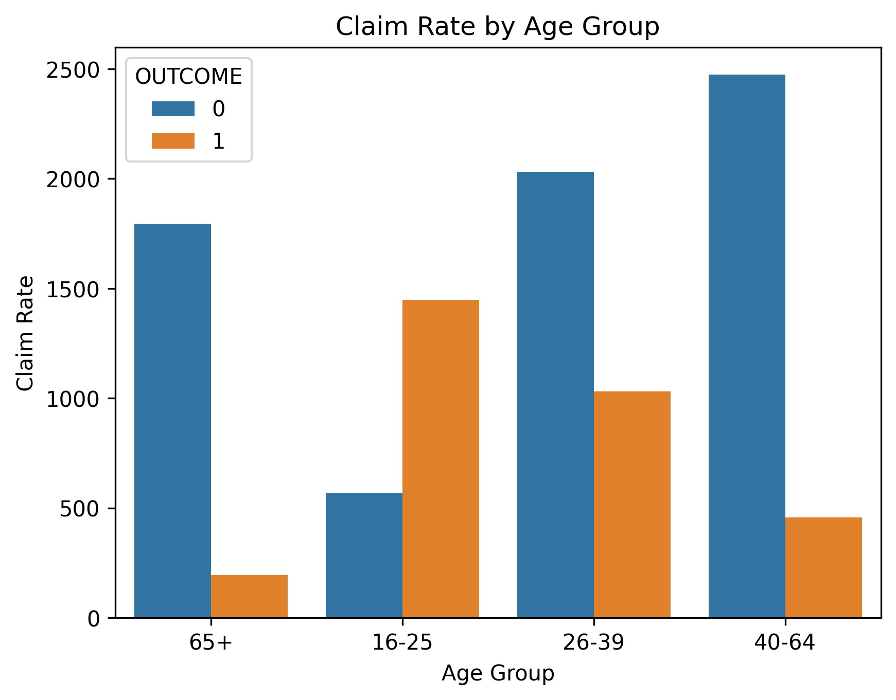
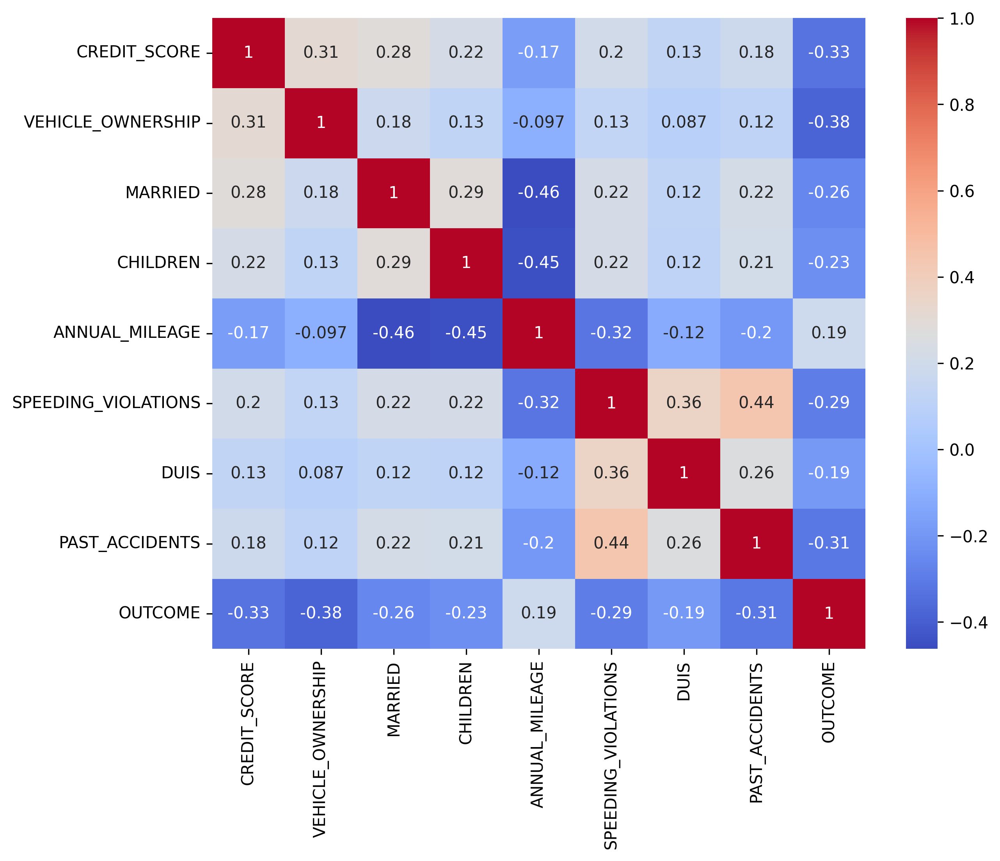
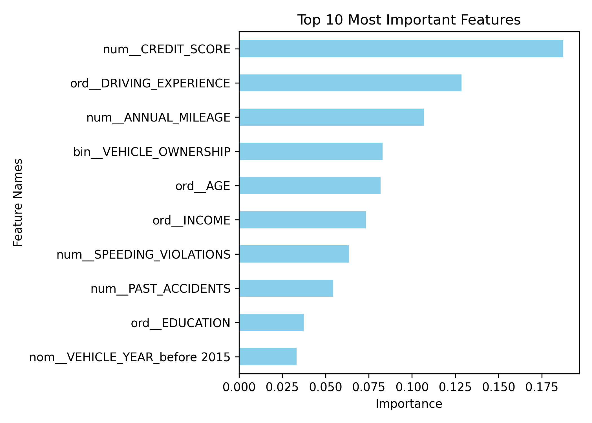

# 🚗 Car Insurance Claim Prediction

A complete Machine Learning project that predicts whether a customer will file a car insurance claim.

The project progresses through three stages:

1. Exploratory Data Analysis (EDA) & Random Forest Baseline
2. Feature Engineering & Feature Selection
3. Deep Learning with Hyperparameter Optimization (Keras Tuner)

---

# 📁 Project Structure

```text
├── Car_Insurance_Claim_Classification.ipynb
├── Car_Insurance_Claim.csv
├── README.md
├── Distribution of Claims.png
├── Claim Rate by Driving Experience.png
├── Average Credit Score by Claim Outcome.png
├── claim_rate_by_age.png
├── vehicle_type_vs_claim.png
├── correlation_heatmap.png
└── top10_features.png
```

---

# 📊 Dataset

- **Size:** 10,000 customers × 19 features
- **Target Variable:** `OUTCOME`
  - 1 = Customer filed a claim
  - 0 = No claim filed

### Feature Categories

| Type | Features |
|--------|----------|
| Numeric | CREDIT_SCORE, ANNUAL_MILEAGE, SPEEDING_VIOLATIONS, DUIS, PAST_ACCIDENTS |
| Binary | VEHICLE_OWNERSHIP, MARRIED, CHILDREN |
| Ordinal | AGE, DRIVING_EXPERIENCE, EDUCATION, INCOME |
| Nominal | GENDER, RACE, VEHICLE_YEAR, VEHICLE_TYPE, POSTAL_CODE |

---

# 📈 Exploratory Data Analysis (EDA)

## Distribution of Claims


### Insight
The dataset is moderately imbalanced, with non-claim customers representing the majority class. This motivated the use of stratified sampling and class balancing techniques during modeling.

---

## Claim Rate by Driving Experience


### Insight
Driving experience is one of the strongest predictors of insurance claims. Less experienced drivers exhibit significantly higher claim rates.

---

## Claim Rate by Age



### Insight
Younger drivers tend to file more insurance claims, reflecting increased driving risk among newer drivers.

---

## Average Credit Score by Claim Outcome


### Insight
Customers who filed claims generally have lower average credit scores, suggesting a relationship between financial responsibility and risk behavior.

---

---

## Correlation Heatmap



### Insight
The heatmap reveals relationships among numerical variables and helps identify important patterns within the dataset.

---

# 🧩 Part 1 — EDA, Preprocessing & Random Forest Baseline

## Objectives

- Data cleaning and preprocessing
- Pipeline construction
- Baseline Random Forest model
- Feature importance analysis

## Preprocessing Pipeline

| Feature Type | Method |
|--------------|---------|
| Numeric | Median Imputation + StandardScaler |
| Binary | Most Frequent Imputation |
| Ordinal | OrdinalEncoder |
| Nominal | OneHotEncoder |

## Model Performance

| Dataset | Accuracy |
|----------|----------|
| Train | 100% |
| Test | 81% |

### Observation
The baseline Random Forest achieved strong performance but clearly overfit the training data.

---

## Top 10 Feature Importances



| Rank | Feature |
|--------|---------|
| 1 | DRIVING_EXPERIENCE |
| 2 | CREDIT_SCORE |
| 3 | ANNUAL_MILEAGE |
| 4 | VEHICLE_OWNERSHIP |
| 5 | AGE |
| 6 | INCOME |
| 7 | SPEEDING_VIOLATIONS |
| 8 | PAST_ACCIDENTS |
| 9 | EDUCATION |
| 10 | VEHICLE_YEAR |

### Key Business Insights

- Lower credit scores correlate with higher claim risk.
- Driving experience is the strongest behavioral predictor.
- Annual mileage increases exposure to accidents.
- Past accidents strongly predict future claims.

---

# ⚙️ Part 2 — Feature Engineering & Feature Selection

## Objectives

- PCA Feature Extraction
- K-Means Clustering
- Embedded Feature Selection
- Model Comparison

## Feature Engineering

| Method | Purpose |
|----------|----------|
| PCA (3 Components) | Dimensionality Reduction |
| K-Means (4 Clusters) | Customer Risk Segmentation |

Feature space expanded from:

```text
24 Original Features
↓
+ 3 PCA Features
+ 1 Cluster Feature
↓
28 Features
```

---

## Feature Selection

Using:

```python
SelectFromModel(RandomForestClassifier())
```

Feature count reduced:

```text
28 Features
↓
14 Selected Features
```

while maintaining virtually identical predictive performance.

---

## Model Comparison

| Model | Features | Accuracy |
|---------|---------|---------|
| Baseline RF | 24 | ~79% |
| RF + PCA + KMeans | 28 | ~79% |
| RF + Feature Selection | 14 | ~79% |

### Conclusion

Feature selection reduced model complexity by 50% without sacrificing accuracy.

---

# 🧠 Part 3 — Neural Network & Hyperparameter Tuning

## Base Neural Network

```text
Input Layer
    ↓
Dense (30, ReLU)
    ↓
Dropout (0.3)
    ↓
Dense (1, Sigmoid)
```

### Configuration

- Loss: Binary Crossentropy
- Optimizer: Adam
- Learning Rate: 0.001
- Early Stopping: Patience = 5

### Results

| Metric | Value |
|----------|----------|
| Accuracy | 84.70% |
| Precision | 0.75 |
| Recall | 0.78 |
| F1 Score | 0.76 |

---

## Hyperparameter Tuning

### Search Space

| Parameter | Values |
|------------|----------|
| Units | 32, 64, 128, 256 |
| Dropout | 0.1 – 0.5 |
| Optimizer | Adam, RMSprop, SGD |
| Learning Rate | 0.0001, 0.001, 0.01 |

### Best Hyperparameters

| Parameter | Best Value |
|------------|------------|
| Units | 256 |
| Dropout | 0.1 |
| Optimizer | RMSprop |
| Learning Rate | 0.001 |

---

## Final Model Comparison

| Metric | Base NN | Tuned NN |
|----------|----------|----------|
| Accuracy | 84.70% | 84.40% |
| Precision | 0.75 | 0.73 |
| Recall | 0.78 | 0.80 |
| F1 Score | 0.76 | 0.76 |

### Recommendation

Although accuracy decreased slightly, the tuned model achieved higher recall.

For insurance applications, recall is often the most important metric because missing a true claimant can be more costly than generating a false positive.

---

# 🏆 Final Results

| Model | Accuracy | Recall |
|----------|----------|----------|
| RF Baseline | 81% | — |
| RF Balanced | 79% | 0.74 |
| RF + PCA + KMeans | 79% | 0.74 |
| RF + Feature Selection | 79% | 0.74 |
| Base Neural Network | 84.70% | 0.78 |
| Tuned Neural Network | 84.40% | 0.80 |

✅ **Recommended Deployment Model:** Tuned Neural Network

Reason:
- Highest Recall
- Strong Generalization
- Better identification of high-risk customers

---

# 🛠️ Tech Stack

- Python
- Pandas
- NumPy
- Matplotlib
- Seaborn
- Scikit-Learn
- TensorFlow / Keras
- Keras-Tuner
- Google Colab

---

# ▶️ How to Run

1. Open the notebook in Google Colab.
2. Upload `Car_Insurance_Claim.csv`.
3. Run all notebook cells.
4. The notebook automatically installs `keras-tuner`.

---

# 👤 Author

**Mohamed Shehada**

Machine Learning Project – AXSOS Academy
